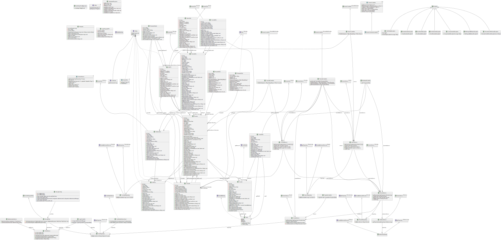

# Projeto avaliativo - Projeto Final
---

Links Úteis:

## Como executar?
1. Execute o arquivo `keys.bat` para gerar os certificados públicos e privados na pasta `resources`;
2. Executar o seguinte comando: `mvn spring-boot:run`

### Diagrama de classes

